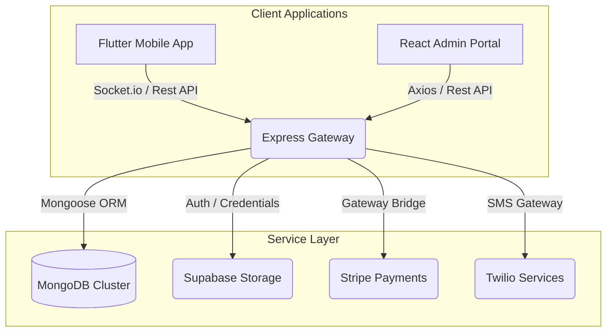

# Campus Covoiturage — University Ride-Sharing Platform

A state-of-the-art, premium ride-sharing platform tailored specifically for Algerian university students. The platform leverages a high-fidelity **Flutter mobile application**, a robust **Node.js/TypeScript/Express backend API**, and a premium **React administrative control center** with a dark, glassmorphic design system.

---

## 🚀 System Architecture



---

## 🛠️ Technology Stack & Structure

### 1. Core Backend (`/backend`)
- **Runtime & Language**: Node.js, TypeScript, Express.js.
- **Database**: MongoDB & Mongoose ORM with 12 strict schema configurations.
- **Websockets**: Real-time location tracking and instant messaging via Socket.io.
- **Services**:
  - Twilio SMS for 2FA / Login codes.
  - Supabase Storage Bucket for identity card and vehicle document storage.
  - Stripe Payments Gateway for cards and CIB escrow.
- **Verification**: Strict schema checks (Zod/Joi), JWT authorization, admin session middleware.

### 2. Flutter Mobile Application (`/mobile`)
- **Theme**: Dark-only aesthetic (`ThemeMode.dark`) with glowing neon accents.
- **State Management**: Riverpod (`StateNotifierProvider`) with total encapsulation.
- **Navigation**: declarative GoRouter with custom subpage paths.
- **Sensors**: Hardware shake detection for instantaneous SOS alerts.
- **Security**: Double-factor authentication (2FA) and localized device storage.

### 3. React Admin Control Center (`/admin`)
- **Stack**: Vite, React, TypeScript, Tailwind CSS v3.
- **Design**: Premium glassmorphic surface cards, customized chart graphics (`recharts`), live stream updates.
- **Key Modules**:
  - **Student Roster Manager**: Search, filter, and review profiles. Includes a manual review system for drivers.
  - **Routing Dashboard**: Real-time commute tracking and booking rosters.
  - **Disputes Control Room**: Live monitoring of SOS signals and user reports.
  - **Stripe Escrow Ledger**: Export CIB card transactions via CSV logs.
  - **Rules & settings**: Modify commission metrics, release timers, and SMTP templates.

---

## 🚦 Getting Started & Local Setup

### Prerequisites
- Node.js (v18+)
- Flutter SDK (v3.22+)
- MongoDB Community Server

### 1. Run the Backend API
1. Navigate to `/backend` and configure your `.env` variables:
   ```env
   PORT=5000
   MONGO_URI=mongodb://localhost:27017/campuscovoiturage
   JWT_SECRET=super_secret_auth_token_key_123
   STRIPE_SECRET_KEY=sk_test_...
   TWILIO_ACCOUNT_SID=AC...
   TWILIO_AUTH_TOKEN=...
   TWILIO_PHONE_NUMBER=...
   SUPABASE_URL=...
   SUPABASE_KEY=...
   ```
2. Install dependencies & run development compiler:
   ```bash
   npm install
   npm run seed      # Populates database with dummy universities, wilayas, and users
   npm run dev       # Launches Nodemon TS compiler on port 5000
   ```
3. To compile production build check:
   ```bash
   npx tsc --noEmit
   ```

### 2. Launch the React Admin Portal
1. Navigate to `/admin` and install dependencies:
   ```bash
   npm install
   ```
2. Launch the Vite dev server:
   ```bash
   npm run dev
   ```
   Open [http://localhost:5173](http://localhost:5173) in your browser.
3. Administrative Demo Credentials:
   - **Email**: `admin@campuscovoiturage.dz`
   - **Password**: `admin123`
4. Build verification check:
   ```bash
   npm run build
   ```

### 3. Build & Run the Mobile App
1. Navigate to `/mobile`.
2. Clean and load flutter packages:
   ```bash
   flutter pub get
   ```
3. Run code diagnostics:
   ```bash
   flutter analyze
   ```
4. Start compilation:
   ```bash
   flutter run
   ```

---

## 🔒 Security & Safety Systems
- **Automatic Escrow**: Payments are securely locked in Stripe and released to the driver 24 hours after completion.
- **Double ID Check**: Student emails are restricted to verified university domains (`.dz`). Drivers must submit an official license card before getting matched.
- **Active SOS Alarm**: Students can trigger emergency location broadcasts by clicking the SOS trigger or shaking their device inside a ride.
